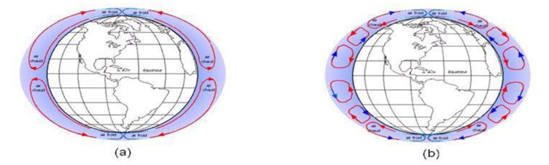

```{r setup, include=FALSE}
knitr::opts_chunk$set(echo = TRUE)
```


## R Markdown

 

```{r cars}
summary(cars)
```




## Including Plots

 

```{r pressure, echo=FALSE}
plot(pressure)
```

$y_i= \alpha_0 + \alpha_1.x_1+\alpha_2.x_2+\alpha_3.x_3+\epsilon$


